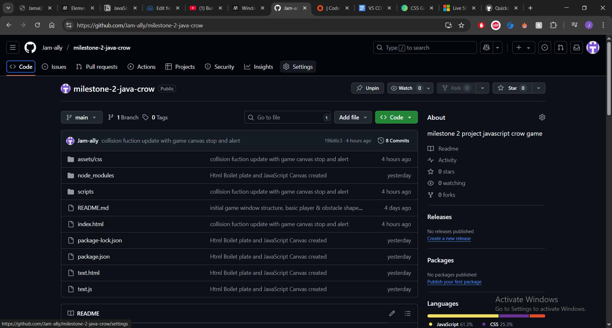
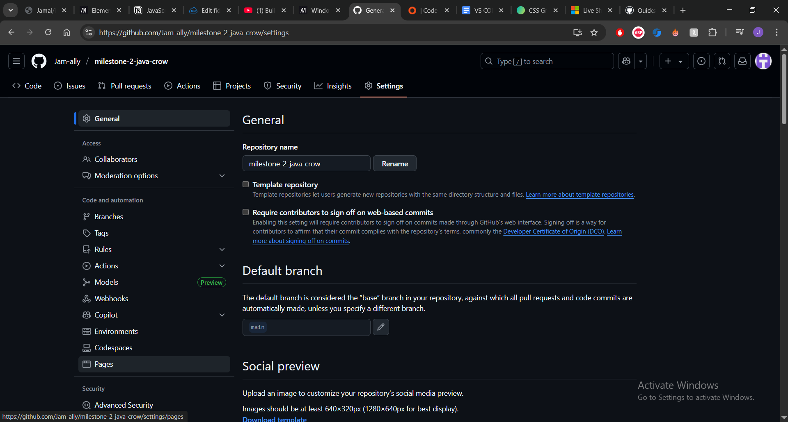
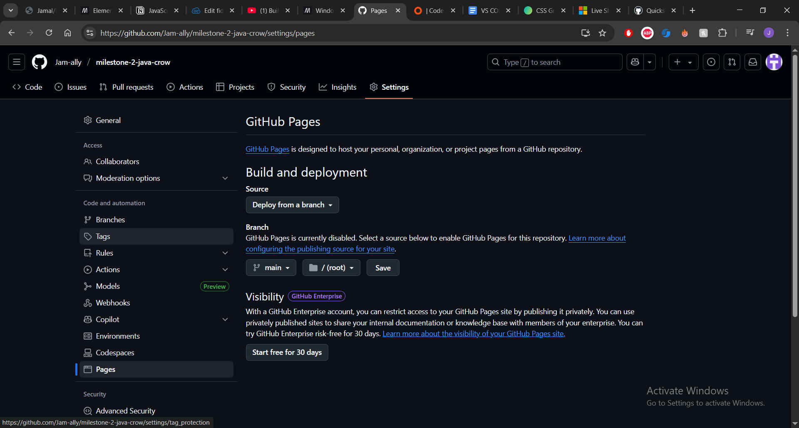
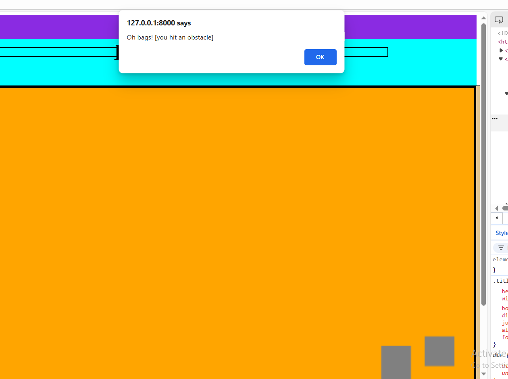

# milestone-2-java-crow

Table of Contents

 ## ContentsOfREADME
  1. [Authour/ Contact](#author-info)
  2. [Link/ToBugTracker](#bug-fixes)
  3. [Known Issues](#known-issues) 
  4. [Navigation](#navigation)
  5. [User Stories](#user-stories)
  6. [Site images](#site-images)
  7. [Colour Scheme](#colourSchemes)
  8. [Build Instructions](#build-instructions)
  9. [Credit](#credit)
  10. [Game Design](~game) 
  11. [Deployment](#deployment)
  12. [Testing](#testing)
  13. [Future Developments](#future-developments)

(****please note this is just a number guide-line, not direct 1-1 headers****)

# Overview

This document outlines the design creation and coding of the "Java Crow" JavaScript Game. A Single player basic JavaScript platform game. The main purpose of the site is to provide access to the game. So that game enjoyers can play the game on-the-go without requirement for specialised proprietary consoles and pheripherals. With Internet access, a Smart Phone, Tablet, Laptop or Desktop. The gammer will be able to enjoy fun and fair within crow world. 

# Monetary 

The game does not require any initial purchases. Discussions for future revenue may include minimal adverts on the page. Well placed and formated as to not draw attention away from the main focus, The Crow World.

# User Stories - Target Audience

The Target audience for this game is 7+ - Adults. The game controls are basic enough that all ages can play and enjoy/

Children 5+: 
    -   Simple Controls 
    -   Improve hand-eye coordination 
    -   Enjoyable 

Teanage:

    -   Simple Controls 
    -   Improve hand-eye coordination 
    -   Enjoyable 

 Adults:

    -   Simple Controls 
    -   Improve hand-eye coordination 
    -   Enjoyable 

Main User Story - Applicable 

    User Story:

    Young Children don't have any suitable games to play. Alot of them online have alot of sounds and affects that increase ADHD and drastically reduce attention span of most.

    Acceptance Criteria:

    The main aspect of this goal is the simple design. The addition of the music, sets the ambience. And also increases positive age appropriate mental stimulation. 

    Tasks:

- Create a HTML Page, style with CSS, utilising appropriate imagery.
- Implement JavaScript code for animation. 
- Music sound track.

### User Story 1: As a player, I want to see a character on screen so I can control it

Acceptance Criteria:

Character is visible on screen

Character has basic idle animation or static image

Character is positioned at the starting point

Tasks:

Create HTML structure for game canvas

Add character sprite/image to canvas

Style character with CSS

Position character using JavaScript

### User Story 2: As a player, I want to move the character up and down using keyboard input

Acceptance Criteria:

Character moves up/down when arrow keys or UpKey/DownKey are pressed

Movement is smooth and responsive

Character stays within screen bounds

Tasks:

Add event listeners for keypresses

Implement movement logic in JavaScript

Update character position on canvas

Prevent character from moving off-screen

### User Story 3: As a player, I want obstacles to appear so I can avoid them

Acceptance Criteria:

Obstacles spawn at regular intervals

Obstacles move from left to right

Obstacles disappear when off-screen

Tasks:

Create obstacle elements

Implement obstacle spawning logic

Animate obstacle movement

Remove obstacles when out of view

### User Story 4: As a player, I want the game to detect collisions so I can lose if I hit an obstacle
Acceptance Criteria:

Collision detection works accurately

Game ends when collision occurs

Visual or audio feedback is provided on collision

Tasks:

Implement bounding box collision detection

Trigger game over state on collision

Add visual/audio effects for feedback

### User Story 5: As a player, I want the background to scroll so it feels like I'm moving forward
Acceptance Criteria:

Background scrolls continuously

Scroll speed matches game pace

Background loops seamlessly

Tasks:

Create background image or pattern

Animate background using CSS or JavaScript

Loop background for infinite scroll effect

### passed necessary validators

## UX

Intuative design and accesibility were at the forefront during the desing of this webpage. To ensure a smooth and enjoyable experience for 
customers. And a dynamic platform to display  Tringks-and-Rings products. Coded in Visual Studio Code (VS). Utilising languages: HTML5 and CSS.

Please note there are valid movement inputs are:

1. On-Screen Buttons
2. Up/Down Arrows on keyboard.

-(All other keydown or mouse interations will be ignored for the movement of the crow)-

## Colour Scheme and Fonts 

Two main fonts were chosen for the site. They were also added to the assets file for the website. Doing so improves the userbility of the website, as font is still visible even with poor network access.

Also used colour gradient generate found on via a google search. 

https://cssgradient.io/

AvQuest 

https://www.1001fonts.com/avqest-font.html
By
GemFonts

Trickster Font
https://www.1001fonts.com/trickster-font.html
By
Velvetyne Type Foundry

### Colours

The colours chosen a representative of crows. With a medieval theme. Dark mysterious colours. Deep, Blacks with Blues and Green hues. Deep Red colours. 

    color: #0a2414;
    color: rgb(19, 61, 35);

## Author / Contact Information

This webpage was designed developed and created by @Jam_Ally 2025. For information about the author please contact @Jam_Ally.

## Bug Tracker 

No further bugs reported. Bug Tracker will be implemented upon receipt of bug reports. [Bug Fixes](#bug-fixes) 

## Known Issues 

None.

## Navigation 

#### Page Log 

*** Summer 2025 ***

*Under Contruction*

----
Webpage loads.

``bash
window.eventListener("DOMContentLoaded" , (event) => {
console.log("DOM is fully loaded and parsed");  })
``

*** Autumn Update ***

-- "DOMContentLoaded"  --

Is used to ensure that the JavaScript only begins running once the DOM is fully loaded. Else some elements or features of the Document Object Model, may not appear or show visible, leading to posibility of multiple errors. 

# Planning

Upon loading the start button is present. A start button was implemented. To reduce page loading time and also for completeness.

A start button start allows the user to press the button and begin the game.

[Also to reset, with ease]

### Wireframes

https://www.figma.com/design/04dcXSvivgHZveBI2ezc1x/Wireframing--Copy-?node-id=77-432&p=f&t=ERjV594SEh2EIJrN-0

# Game Play - Design & Development 

Model the Game Environment 
-	Game window
-	Boundaries
Render the Crow 
-	Create the crow figure 
-	Apply necessary Gravity Factor
-	Crow movement speed
-	Interaction parameters
    - Player controls etc

Render the Obstacle 
	-create the obstacle 
	-speed increase
	- multiple obstacles 
    -randomly generate between the 3+ different obstacles 
    - bike, bollard, lampost 

Move Background
    - Obstacle movement by moving the background 
    -Background is a large

Collision Logic and effects
    - Upon collision game should stop moving 
    -alert to tell player that there was a collision 
    - The game should then proceed to Game over or Restart as necessary - based on player input

Start Screen
    -Starting screen with Game title
    

Game Over/ Continue Screen 

Story Board

-Create Text Intro for the game - Outlinning the game mission

- Include images and text

startGame() // loads the start game function which contains various elements and functions.

### development

Development of food crow was completed in multiple stages.

Inially consisting of a webpage with an interactive screen touch up/down control
And a second html page with the text based portion of the game.

The two were then linked via buttons with event listeners, and JS to interact with the CSS. Adding / rmeoving necessary classes. And adjusting parameters and visual look of the web pages. 

During review discussions. It became clear that the game flow would improve by keeping the game to one page for html, one page for css and one page for Javascript. 

The new and current webpage was created to portray a minmalist,historical style. 

With the two parts of the game readily accessible with easy access and intuative controls. 

During the design and creation process of the web based game. A combination of Test Driven Design and Purpose Driven Design was implemented. Striking a balance between these two design methodologies. Allowed for robust and thorough design. Whilst also ensure the developing process, reached completion effeciently and in a reasonable time frame.  

behaviour driven development
test driven development 

When laying out the format for the HTML.

Initial index.html page. Included place holders for Navigation Bar, Header, Main Body and Footer. There is also a preliminary menu bar div, for buttons. This also allowed for great option of creating buttons to test elements and components of the web page.
Within the header, a <h1> title “Food Bird”.
<main>
Within main. First step was to allocate the available screen space and pixels where the game will be. In order to provide this space a section with class=”game-tile was created. All game play will take place within this space. 

F<footer>
The footer contains the page footer. With Copy right information. 

## Game views

Within the main components of the webpage listed above and style with CSS. 
The game portions were created in:

section called
    Game Tile  - This sections and holds and keeps safe the the components of the game. 

Div
    Game Window - This Div can be found within the game tile and is proportionally smaller 

Div 
    Game Frame - This dev is again smaller Next layer.

Div 
    Game Grid   - Text Layer.

Thesse divs contain the components fo the game, i.e. player controls and this is where the game Canvas is created by JavaScript, upon initiation via the start button. 

The animation aspect of the game, included various tests throughout. To ensure the loops and functionality was operating as expected. 

commits

## Deployment 

### Step 1

Open GitHub Repository.

### Step 2
Open the Specific GitHub Repository.

### Step 3
Navigate to the settings.

### Step 4
Navigate to Github Pages settings.

### Step 5
Select - Main Branch and /root.  (please refer to your specific repository if your source branch is different.)

### Step 6
Deploy page and await deployment - (may initially take few mins or more).

### Testing 

Thorough step by step process throughout. Durign intial stages of the project Jest was used. During latter stages of developement. The same structure and style of testing was used as with jest. However using a more holistic form , through "console.log" and "alert". To output desired variables, arrays and outcomes. 

This hyrbidisation of the test allowed for firmness of testing structure. Whilst also allowing for free flowing and natural creativity. 

All stages of the developement were tested.

*** JEST initialisation ***

*** Dimensions Responsive - to ensure usability on the widest variety of users and variety of devices. ***

*** Sent to prospective BETA testers. ***

Function testing process:

-function purpose - plain writting english

-function name - suitable and meaningful - w.r.t purpose

- cosole.log - ensuring function is being called. 
    inc currect timing, and place and location.

- build functionality. step by step. Failure & Passing functionality.

- Rinse and repeat. 

-*Refactory - ie for the collision and rendering enemy. Based on interactions and user experience. 

## Bugs

### BUG FIX 1
https://stackoverflow.com/questions/71960798/javascript-functions-stop-working-when-using-import-at-top-of-script-even-witho

Importing the -- player1  -- class. Caused the main game.js script to fail.

The fix was applying the type module to the script element

``bash

By applying type="module" to the <script> element, the export class player1 , the main game.js script was able to import the player1 class. 

``

### BUG FIX 2

*Reasoning:* Reasons for the immediate and repetitive actions. It appears that the interaction areas for the shapes are still in contact as you press ok. This means that the error message consistently popped up. Each time the user interacts by pressing the “OK” button. 

*Resolution:* In order to resolve this matter a new variable and function were created. This implementation of a player lives into the coding logic. Meant that any further interactions with the objects; did not have any issues.*Game in working order. User can interact with all player interfaces.

## CREDITS 

Honarable mention to LJ, BM, all the BETA testers , and finally JL. 

Also creddit to Franks laboratory. Franks Laboratory's JavasScript Side Scroller Game Tutorial https://www.youtube.com/watch?v=7JtLHJbm0kA was extremely help in some tricky areas of coding.

Also a thanks to the likes of M3 and stackoverlow users. With some great inspiration and solution growing ideas. 

# ENJOY THE GAME! :D

