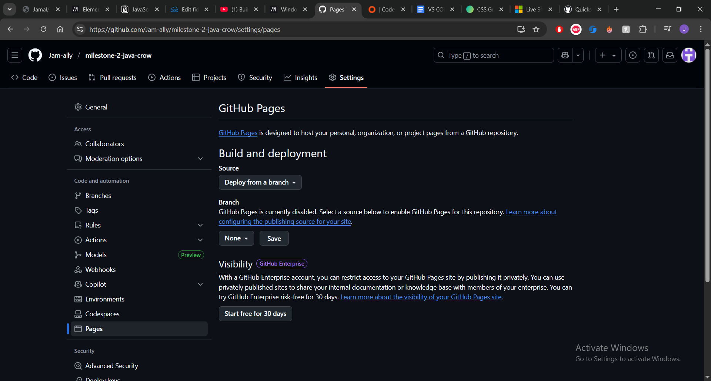
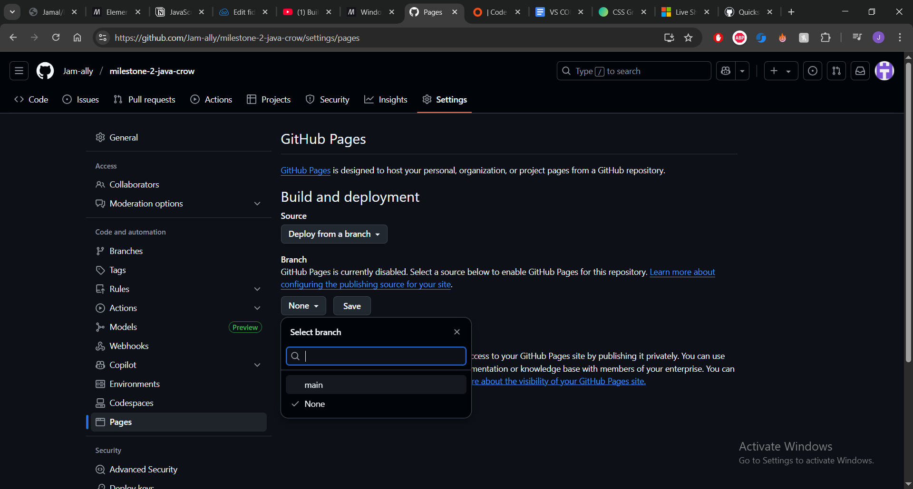

# milestone-2-java-crow

Table of Contents

 ## Contents
  1. [Authour/ Contact](#author-info)
  2. [Link/ToBugTracker](#bug-fixes)
  3. [Known Issues](#known-issues) 
  4. [Navigation](#navigation)
  5. [User Stories](#user-stories)
  6. [Site images](#site-images)
  7. [Colour Scheme](#colourSchemes)
  8. [Build Instructions](#build-instructions)
  9. [Credit](#credit)
  10. [Game Design](~game) 
  11. [Deployment](#deployment)
  12. [Testing](#testing)
  13. [Future Developments](#future-developments)

# Overview

This document outlines the design creation and coding of the "Java Crow" JavaScript Game. A Single player basic JavaScript platform game. The main purpose of the site is to provide access to the game. So that game enjoyers can play the game on-the-go without requirement for specialised proprietary consoles and pheripherals. With Internet access, a Smart Phone, Tablet, Laptop or Desktop. The gammer will be able to enjoy fun and fair within crow world. 

# Monetary 

The game does not require any initial purchases. Discussions for future revenue may include minimal adverts on the page. Well placed and formated as to not draw attention away from the main focus, The Crow World.

# User Stories - Target Audience

The Target audience for this game is 7+ - Adults. The game controls are basic enough that all ages can play and enjoy/

Children 5+: 
    -   Simple Controls 
    -   Improve hand-eye coordination 
    -   Enjoyable 

Teanage:

    -   Simple Controls 
    -   Improve hand-eye coordination 
    -   Enjoyable 

 Adults:

     -   Simple Controls 
    -   Improve hand-eye coordination 
    -   Enjoyable 

    User Story:

    Young Children don't have any suitable games to play. Alot of them online have alot of sounds and affects that increase ADHD and drastically reduce attention span of most.

    Acceptance Criteria:

    The main aspect of this goal is the simple design. The addition of the music, sets the ambience. And also increases positive age appropriate mental stimulation. 

    Tasks:

- Create a HTML Page, style with CSS, utilising appropriate imagery.
- Implement JavaScript code for animation. 
- Music sound track.

### User Story 1: As a player, I want to see a character on screen so I can control it

Acceptance Criteria:

Character is visible on screen

Character has basic idle animation or static image

Character is positioned at the starting point

Tasks:

Create HTML structure for game canvas

Add character sprite/image to canvas

Style character with CSS

Position character using JavaScript

### User Story 2: As a player, I want to move the character up and down using keyboard input

Acceptance Criteria:

Character moves up/down when arrow keys or UpKey/DownKey are pressed

Movement is smooth and responsive

Character stays within screen bounds

Tasks:

Add event listeners for keypresses

Implement movement logic in JavaScript

Update character position on canvas

Prevent character from moving off-screen

### User Story 3: As a player, I want obstacles to appear so I can avoid them

Acceptance Criteria:

Obstacles spawn at regular intervals

Obstacles move from left to right

Obstacles disappear when off-screen

Tasks:

Create obstacle elements

Implement obstacle spawning logic

Animate obstacle movement

Remove obstacles when out of view

### User Story 4: As a player, I want the game to detect collisions so I can lose if I hit an obstacle
Acceptance Criteria:

Collision detection works accurately

Game ends when collision occurs

Visual or audio feedback is provided on collision

Tasks:

Implement bounding box collision detection

Trigger game over state on collision

Add visual/audio effects for feedback

### User Story 5: As a player, I want the background to scroll so it feels like I'm moving forward
Acceptance Criteria:

Background scrolls continuously

Scroll speed matches game pace

Background loops seamlessly

Tasks:

Create background image or pattern

Animate background using CSS or JavaScript

Loop background for infinite scroll effect

## UX

Intuative design and accesibility were at the forefront during the desing of this webpage. To ensure a smooth and enjoyable experience for 
customers. And a dynamic platform to display  Tringks-and-Rings products. Coded in Visual Studio Code (VS). Utilising languages: HTML5 and CSS.

Please note there are valid movement inputs are:

1. On-Screen Buttons
2. Up/Down Arrows on keyboard.

-(All other keydown or mouse interations will be ignored for the movement of the crow)-

## Colour Scheme and Fonts 

Two main fonts were chosen for the site. They were also added to the assets file for the website. Doing so improves the userbility of the website, as font is still visible even with poor network access.

AvQuest 

https://www.1001fonts.com/avqest-font.html
By
GemFonts

Trickster Font
https://www.1001fonts.com/trickster-font.html
By
Velvetyne Type Foundry

### Colours

The colours chosen a representative of crows. With a medieval theme. Dark mysterious colours. Deep, Blacks with Blues and Green hues. Deep Red colours. 

    color: #0a2414;
    color: rgb(19, 61, 35);

 

## Author / Contact Information

This webpage was designed developed and created by @Jam_Ally 2025. For information about the author please contact @Jam_Ally.

## Bug Tracker 

No further bugs reported. Bug Tracker will be implemented upon receipt of bug reports. [Bug Fixes](#bug-fixes) 

## Known Issues 

None.

## Navigation 

*Under Contruction*

----
Webpage loads.

``bash
window.eventListener("DOMContentLoaded" , (event) => {
console.log("DOM is fully loaded and parsed");  })
``

Planning

Upon loading the start button is present. A start button was implemented. To reduce page loading time and also for completeness.

A start button start allows the user to press the button and begin the game.

[ALso to reset, with eas[

]]

Game Play

Model the Game Environment 
-	Game window
-	Boundaries
Render the Crow 
-	Create the crow figure 
-	Apply necessary Gravity Factor
-	Crow movement speed
-	Interaction parameters
    - Player controls etc

Render the Obstacle 
	-create the obstacle 
	-speed increase
	- multiple obstacles 
    -randomly generate between the 3+ different obstacles 
    - bike, bollard, lampost 

Move Background
    - Obstacle movement by moving the background 
    -Background is a large

Collision Logic and effects
    - Upon collision game should stop moving 
    -alert to tell player that there was a collision 
    - The game should then proceed to Game over or Restart as necessary - based on player input

Start Screen
    -Starting screen with Game title
    

Game Over/ Continue Screen 

Story Board

-Create Text Intro for the game - Outlinning the game mission

- Include images and text

startGame() // loads the start game function which contains various elements and functions.

development 

commits

## Deployment 

### Step 1

Open GitHub Repository.

### Step 2
Open the Specific GitHub Repository.

### Step 3
Navigate to the settings.

### Step 4
Navigate to Github Pages settings.

### Step 5
Select - Main Branch and /root.  (please refer to your specific repository if your source branch is different.)

### Step 6
Deploy page and await deployment - (may initially take few mins or more).

## Bugs

### BUG FIX 1
https://stackoverflow.com/questions/71960798/javascript-functions-stop-working-when-using-import-at-top-of-script-even-witho

Importing the -- player1  -- class. Caused the main game.js script to fail.

The fix was applying the type module to the script element

``bash

By applying type="module" to the <script> element, the export class player1 , the main game.js script was able to import the player1 class. 

``

### BUG FIX 2

*Reasoning:* Reasons for the immediate and repetitive actions. It appears that the interaction areas for the shapes are still in contact as you press ok. This means that the error message consistently popped up. Each time the user interacts by pressing the “OK” button. 

*Resolution:* In order to resolve this matter a new variable and function were created. This implementation of a player lives into the coding logic. Meant that any further interactions with the objects; did not have any issues.*Game in working order. User can interact with all player interfaces.

# ENJOY THE GAME! :D
